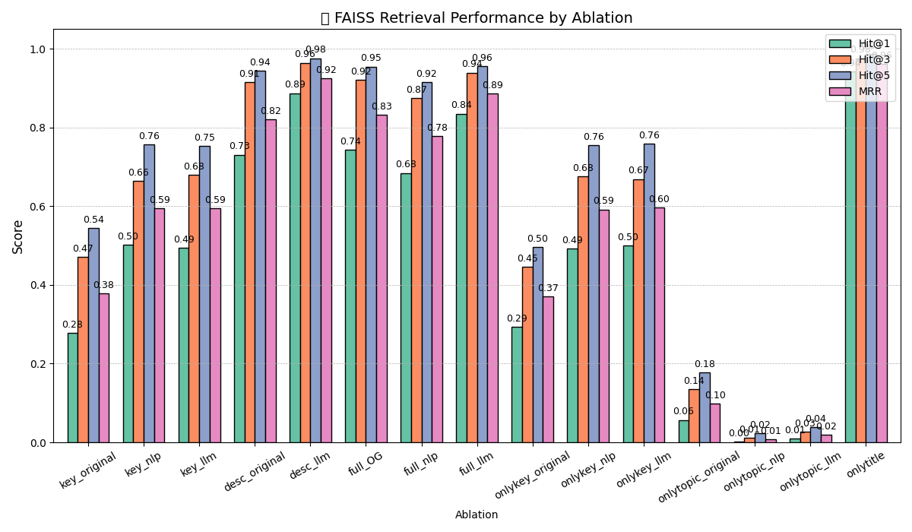

# GLA Metadata Field Analysis

This repository contains research code and data for evaluating how different metadata fields affect semantic retrieval over Greater London Authority (GLA) / London Datastore-style dataset records.

The project builds FAISS indices from different metadata representations, such as titles, keywords, topics, descriptions, and enriched variants, then evaluates retrieval performance against user queries.

## Project overview

The goal of this project is to compare how well different metadata-field combinations support semantic dataset search.

The repository currently includes:

- `data/` — JSON files containing dataset metadata variants and user query sets.
- `models/faiss_search.py` — builds FAISS indices for each metadata ablation.
- `models/faiss_indices/` — generated FAISS indices and ID mappings.
- `evaluation/evaluate_faiss.py` — evaluates retrieval performance.
- `evaluation/` — generated plots and CSV outputs from the evaluation runs.
- `LICENSE` — project license.

## Installation

```bash
git clone https://github.com/lalisalala/GLA.git
cd GLA
code .
python -m venv .venv
## Results

The main results below correspond to the paper:

> Lisa-Yao Gan, Arunav Das, Johanna Walker, and Elena Simperl.  
> **Keywords are not always the key: A metadata field analysis for natural language search on open data portals.**  
> arXiv:2509.14457v1, 2025.  
> https://arxiv.org/abs/2509.14457

The study evaluates how different metadata fields affect natural language dataset retrieval over London Datastore / Greater London Authority metadata. Retrieval was performed using `BAAI/bge-base-en` embeddings and FAISS, with performance measured using `Hit@1`, `Hit@3`, `Hit@5`, and mean reciprocal rank (`MRR`).

### Overall retrieval performance

| Ablation condition | Hit@1 | Hit@3 | Hit@5 | MRR |
|---|---:|---:|---:|---:|
| `key_original` | 0.279 | 0.471 | 0.544 | 0.379 |
| `key_nlp` | 0.502 | 0.664 | 0.757 | 0.594 |
| `key_llm` | 0.495 | 0.680 | 0.753 | 0.594 |
| `desc_original` | 0.731 | 0.915 | 0.944 | 0.820 |
| **`desc_llm`** | **0.887** | **0.964** | **0.976** | **0.925** |
| `full_original` | 0.744 | 0.921 | 0.955 | 0.833 |
| `full_nlp` | 0.684 | 0.874 | 0.916 | 0.778 |
| `full_llm` | 0.835 | 0.940 | 0.956 | 0.887 |
| `onlykey_original` | 0.293 | 0.446 | 0.496 | 0.371 |
| `onlykey_nlp` | 0.492 | 0.676 | 0.756 | 0.592 |
| `onlykey_llm` | 0.499 | 0.669 | 0.759 | 0.597 |
| `onlytopic_original` | 0.057 | 0.135 | 0.177 | 0.098 |
| `onlytopic_nlp` | 0.001 | 0.012 | 0.024 | 0.008 |
| `onlytopic_llm` | 0.009 | 0.027 | 0.038 | 0.019 |

The strongest configuration is **`desc_llm`**, showing that LLM-generated descriptions are the most effective metadata representation for natural language dataset retrieval in this setup.

### Evaluation plot



### Query-type performance

Values are reported as `MRR / Hit@1`.

| Ablation | Requesting | Describing | Implying |
|---|---:|---:|---:|
| `key_original` | 0.394 / 0.295 | 0.392 / 0.295 | 0.351 / 0.246 |
| `desc_llm` | 0.962 / 0.943 | 0.907 / 0.861 | 0.906 / 0.858 |
| `full_llm` | 0.927 / 0.890 | 0.862 / 0.804 | 0.872 / 0.811 |
| `onlytopic_llm` | 0.024 / 0.014 | 0.017 / 0.007 | 0.017 / 0.007 |

The paper reports that descriptions, especially LLM-generated descriptions, perform best across query types, while topic-only metadata performs poorly.

## Citation

If you use this repository, please cite:

```bibtex
@InProceedings{10.1007/978-3-032-16451-3_26,
author="Gan, Lisa-Yao
and Das, Arunav
and Walker, Johanna
and Simperl, Elena",
editor="Krems, Josef F.
and da Silva, Hugo Pl{\\'a}cido
and Cipresso, Pietro",
title="Keywords Are Not Always the Key: A Metadata Field Analysis for Natural Language Search on Open Data Portals",
booktitle="Computer-Human Interaction Research and Applications",
year="2026",
publisher="Springer Nature Switzerland",
address="Cham",
pages="421--440",
isbn="978-3-032-16451-3"
}
